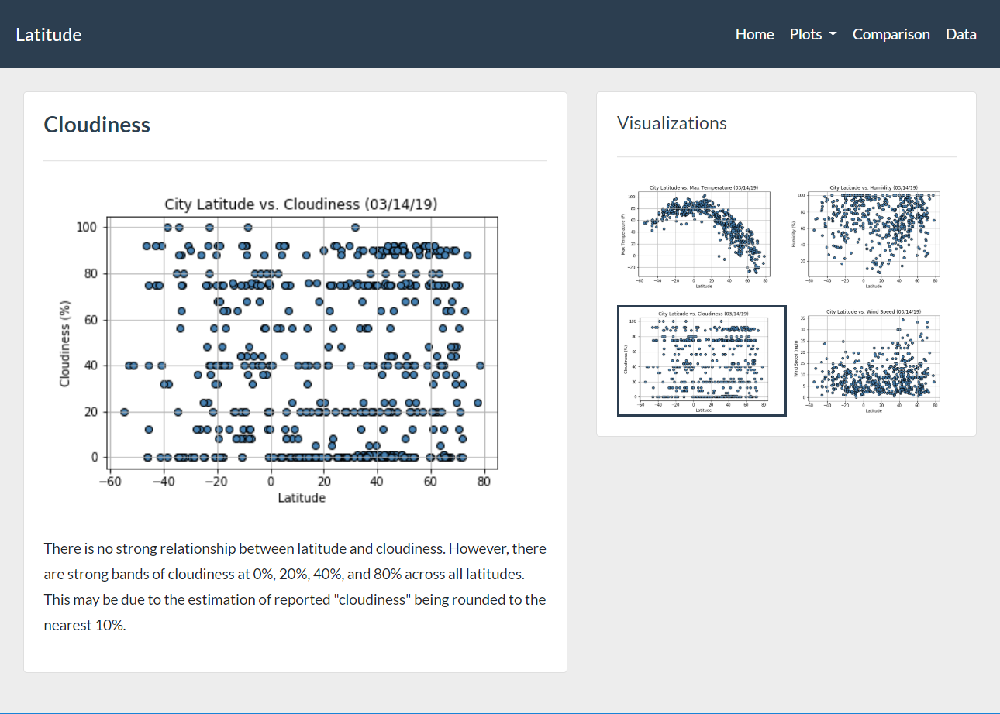

# Latitude and Weather Web Visualization Dashboard

**Description**  
Latitude analysis dashboard using responsive layouts and html/css. Analysis of changes in weather with respect to distance from the equator, all data collected using the OpenWeatherMap API. Summary statistics and visualizations created using Python, Pandas, and Matplotlib.  

The Main dashboard includes a navbar for navigation, a summary of the project, and a panel with thumbnails of the detail pages.  

  

----  

The Comparison page allows click-through to each of the four plots.  

----  

One of the plot pages showing the results and a brief description.  

----  

The Data page, showing the source data used for this analysis.  

